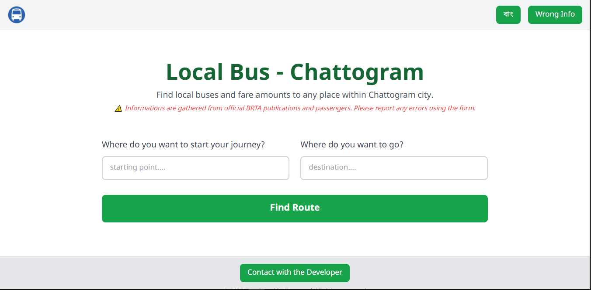
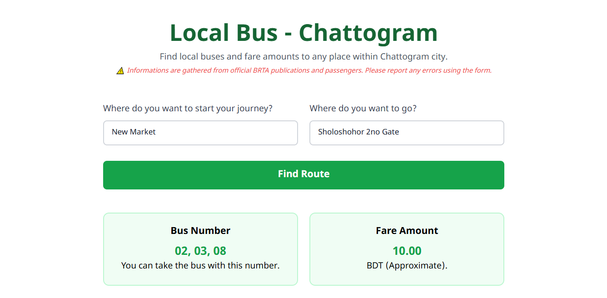

# Local Bus - Chattogram

⭐ Star on GitHub if you like — it motivates me a lot!

The other day, I was working on some tasks. Then suddenly I noticed something. Almost every city has a system where users can find details about local buses and their routes. But for my city, Chattogram (previously Chittagong), there is nothing like this. 

So, I thought of making one by myself, in which user can search for local bus available for their destination and possible fare amount. And there it is. 

## Technical details

Well, for this website, these tech stacks are used. The goal of this website was to keep it minimal and user-friendly and not overly complicated. 

All the information on Bus Route and Fare amount is collected from the Government Website of "Chatto-Metro," published in 2022. 

## Features

This website focuses on functionality rather than features. So, this website has a very minimal amount of features.

- <b> Route and Fair Finder </b>: This is the core functionality of the website where users can input their location and destination point and find the available buses with a possible fare amount. 

 

- <b> Multilingual Support </b>: Although this website is made for people in Bangladesh, there is also English language support for non-Bangladeshi people so that everybody can use it. 
- <b> Data Improvement </b>: Since the source of data is a little bit backdated now, users can report wrong data via Google Form.

## Developers Note

If you are a User and using this website for finding Bus routes, then don't blindly depend on website and do a cross-check. 

If you are a fellow Bangladeshi Developer and want to add a version of your own city, you can contact me directly on <a href="https://www.facebook.com/tarunna.002" target ="_blank"> Facebook </a>.

## Contributors

These are the people who helped make this website better.

- <a href="https://www.facebook.com/mahfux090" target="_blank"> Mohammad Mahfuz Uddin </a>: Helped sorting and Organizing the Government Data.

 

 

If you have any suggestions or anything to say related to this project, let me know.